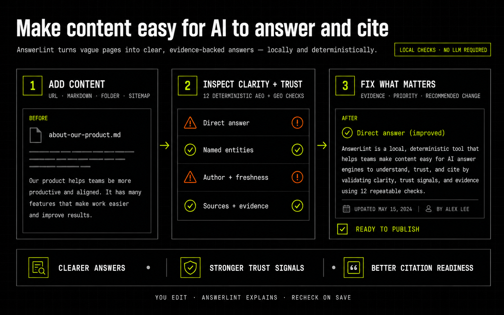
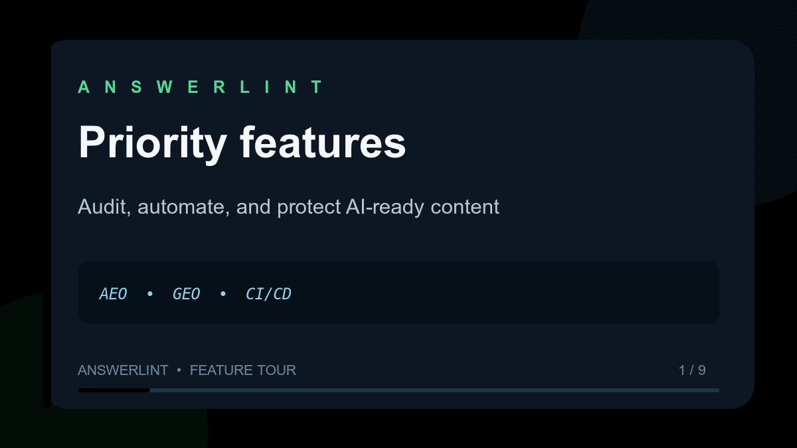

# answerlint

[](https://www.npmjs.com/package/answerlint)
[](https://www.npmjs.com/package/answerlint)
[](https://github.com/rakeshcheekatimala/answerlint/actions/workflows/ci.yml)
[](https://github.com/rakeshcheekatimala/answerlint/actions/workflows/snyk.yml)
[](https://github.com/rakeshcheekatimala/answerlint/actions/workflows/codeql.yml)
[](https://scorecard.dev/viewer/?uri=github.com/rakeshcheekatimala/answerlint)
[](https://github.com/rakeshcheekatimala/answerlint/blob/main/LICENSE)

`answerlint` shows whether AI answer engines can understand, trust, and cite your
content—and what to improve when they cannot.

## Why teams can trust this release

AnswerLint is open source, published from a protected GitHub Actions release
workflow, and checked on every change. You do not have to take a badge on trust:
each badge links to the public evidence behind it.

| Signal | What it means in plain English |
|---|---|
| npm version | Shows the version users actually receive from npm. |
| Node.js | Shows the supported Node.js runtime declared by the package. |
| Tests, coverage, and audit | Runs the test matrix, enforces at least 85% line coverage, checks package contents, and audits dependencies. |
| Snyk Security | Scans dependencies and source code for high-severity security findings. |
| CodeQL | GitHub analyzes the JavaScript and TypeScript for security vulnerabilities. |
| OpenSSF Scorecard | Provides an independent, public assessment of repository security practices. |
| MIT License | Confirms the permissions and conditions under which the library can be used. |

Releases use npm Trusted Publishing with short-lived OpenID Connect credentials,
so no long-lived npm publishing token is stored in the repository. npm also
records provenance for the published package. These controls reduce supply-chain
risk, but no automated scan can promise that software is completely defect-free.



### Priority feature tour



## How It Helps

```text
Your content          AnswerLint checks           You improve
URL / Markdown   →    clarity + trust + evidence  → direct answers
folder / sitemap      14 built-in checks           stronger sources
                                                   clearer authorship
```

1. **Add content.** Start with one URL or Markdown file, or audit a folder or
   sitemap when you are ready to scale.
2. **Inspect clarity and trust.** AnswerLint checks direct-answer quality,
   entities, readability, authorship, freshness, sources, structured data, and
   citation readiness.
3. **Fix what matters.** Each failed or warning check includes evidence,
   priority, expected score impact, and a recommended change.
4. **Edit and recheck.** Update the source yourself and run the audit again—or
   use the local TUI to refresh automatically whenever a Markdown file is saved.

> AnswerLint never rewrites your content silently. It explains the problem and
> recommends a change; you keep editorial control.

### Choose the shortest path

| I want to… | Run |
|---|---|
| Improve one Markdown document while writing | `npx answerlint@latest tui --watch ./article.md` |
| Check one published page | `npx answerlint@latest audit --url "https://example.com/page" --output html` |
| Review a content library | `npx answerlint@latest audit --dir ./docs --output csv` |
| Prevent a pull request regression | `npx answerlint@latest diff --base-report base.json --head-report current.json --fail-on-regression` |
| Validate AI manifests and live links | `npx answerlint@latest lint-llms llms.txt --ci` |
| Produce code-scanning output | `npx answerlint@latest audit --dir ./docs --output sarif` |

The scores help prioritize work. They do not guarantee rankings or citations.

## What Teams Can Answer

It helps teams answer four practical questions:

- Is this page structured clearly enough for AI systems to summarize, trust, and cite?
- How does this page compare with a competitor or reference page?
- Did this pull request improve or weaken AI visibility before it ships?
- Is the site publishing a clean, valid `llms.txt` roadmap for AI agents?

The package reads pages, local files, folders, sitemaps, or existing audit
reports, runs a deterministic AEO/GEO rubric, and produces reports with scores,
evidence, and recommended fixes.


## Why It Exists

Traditional SEO checks do not always reveal whether a page is useful to AI answer engines.

A page can rank in search and still be weak for:

- direct answer extraction
- entity and topic clarity
- source and authorship trust
- freshness signals
- external proof links
- comparison-friendly content
- citation readiness

`answerlint` is designed to be a lightweight quality gate for that layer of work. Think of it like Lighthouse or ESLint, but for AI visibility signals in content.

## What Makes It Different

- **Deterministic by default**: no hidden LLM judge is required to score a page.
- **Evidence-backed**: every audit produces a pass, warning, or failure with supporting evidence.
- **CI-friendly**: use score thresholds and diff gates to fail a build when visibility regresses.
- **LLM roadmap automation**: generate and lint `llms.txt` / `llms-full.txt` from source content during builds.
- **Readable for humans**: HTML reports make it easy for content, SEO, and engineering teams to review the same findings.
- **Reusable for tooling**: JSON and CSV outputs are stable enough for dashboards, PR comments, and downstream automation.
- **Useful before shipping**: AI Visibility Diff compares baseline and pull request reports before changes go live.

## Features

Current CLI commands:

- `answerlint overview`
- `answerlint info`
- `answerlint audit`
- `answerlint diff`
- `answerlint llms generate`
- `answerlint llms lint`

Supported audit inputs:

- live URL
- local Markdown or HTML file
- local folder of content files
- sitemap or sitemap index

Supported outputs:

- HTML for human review
- JSON for automation
- CSV for batch audit summaries
- HTML or JSON diff reports for pull request workflows
- competitor comparison reports when `audit --compare` is used with `--url`
- generated `llms.txt` and optional `llms-full.txt` for AI agents

## llms.txt Generation & Linting

Generate a site-level AI roadmap from a public website URL. AnswerLint fetches
the seed page, discovers sitemap URLs when available, falls back to same-site
homepage links, extracts deterministic titles/descriptions, and writes a valid
`llms.txt`:

```bash
answerlint llms generate \
  --url "https://example.com" \
  --site-name "Example Site" \
  --summary "Example Site publishes product docs and implementation guides." \
  --out ./public \
  --full
```

When crawling a preview or staging URL, use `--site` to emit production links:

```bash
answerlint llms generate \
  --url "https://preview.example.dev" \
  --site "https://example.com" \
  --out ./public
```

Generate a deterministic AI roadmap from local Markdown, MDX, or HTML content:

```bash
answerlint llms generate \
  --dir ./docs \
  --site "https://example.com" \
  --site-name "Example Site" \
  --summary "Example Site publishes product docs and implementation guides." \
  --out ./public \
  --full
```

Validate the generated file in CI:

```bash
answerlint llms lint ./public/llms.txt --strict --ci
```

The generator uses deterministic extraction only: frontmatter, HTML metadata, H1s, first paragraphs, URLs, and path-based sectioning. No AI or model key is required. This keeps build output reproducible and reviewable. AI-assisted summaries may be added later as an explicit opt-in layer, but the core feature is designed to be stable in CI.

## Quick Start

Fastest way to understand the product:

- website and playground: [useanswerlint.com](https://useanswerlint.com/)
- npm package: [answerlint on npm](https://www.npmjs.com/package/answerlint)
- source code: [GitHub repo](https://github.com/rakeshcheekatimala/answerlint)

Run without installing globally:

```bash
npx answerlint overview
```

Install globally:

```bash
npm install -g answerlint
```

Audit one live page:

```bash
answerlint audit \
  --url "https://example.com/docs/article" \
  --output html \
  --output-path ./answerlint-report.html
```

Audit one local file:

```bash
answerlint audit \
  --file ./examples/sample.html \
  --output json \
  --output-path ./answerlint-report.json
```

Audit a folder:

```bash
answerlint audit \
  --dir ./examples \
  --output csv \
  --output-path ./answerlint-batch.csv
```

Audit a sitemap:

```bash
answerlint audit \
  --sitemap "https://example.com/sitemap.xml" \
  --output csv \
  --output-path ./answerlint-sitemap.csv
```

## Competitor Compare

Competitor compare audits a target URL and a competitor or reference URL side by side.

Use it when you want to understand where another page has stronger answerability, citation, schema, or trust signals.

```bash
answerlint audit \
  --url "https://example.com/docs/article" \
  --compare "https://competitor.example/docs/article" \
  --output html \
  --output-path ./answerlint-compare-report.html
```

Generate a JSON comparison report:

```bash
answerlint audit \
  --url "https://example.com/docs/article" \
  --compare "https://competitor.example/docs/article" \
  --output json \
  --output-path ./answerlint-compare-report.json
```

Compare mode is currently supported for `--url` audits. Folder, file, and sitemap comparison workflows are planned follow-ups.

## AI Visibility Diff

AI Visibility Diff compares a baseline audit report with a current pull request report. It shows whether a change improved or regressed AI visibility.

This is useful in CI because it catches content and markup regressions before deployment.

Compare two existing JSON audit reports:

```bash
answerlint diff \
  --base-report ./baseline-report.json \
  --head-report ./current-report.json \
  --output html \
  --output-path ./answerlint-diff-report.html
```

Generate a machine-readable diff:

```bash
answerlint diff \
  --base-report ./baseline-report.json \
  --head-report ./current-report.json \
  --output json \
  --output-path ./answerlint-diff-report.json
```

Fail CI when visibility regresses:

```bash
answerlint diff \
  --base-report ./baseline-report.json \
  --head-report ./current-report.json \
  --fail-on-regression \
  --max-composite-drop 0 \
  --max-aeo-drop 0 \
  --max-geo-drop 0 \
  --max-citation-readiness-drop 0
```

Require minimum improvements:

```bash
answerlint diff \
  --base-report ./baseline-report.json \
  --head-report ./current-report.json \
  --min-composite-delta 0 \
  --min-aeo-delta 0 \
  --min-geo-delta 0
```

Example diff summary:

```json
{
  "summary": {
    "status": "improved",
    "baseScore": 74,
    "headScore": 82,
    "delta": 8
  },
  "scoreDiffs": {
    "composite": {
      "base": 74,
      "head": 82,
      "delta": 8,
      "status": "improved"
    },
    "aeo": {
      "base": 78,
      "head": 85,
      "delta": 7,
      "status": "improved"
    }
  },
  "ci": {
    "passed": true,
    "reasons": []
  }
}
```

## What It Checks

The current audit rubric contains 14 built-in checks, plus declarative project rules.

### AEO

- FAQ or HowTo schema
- direct answer in the first paragraph
- Q&A density
- readability
- named entities
- author byline

### GEO

- topical depth
- trust signals
- content freshness
- external citations
- comparison content
- citation likelihood
- entity relationship density based on explicit Wikipedia/Wikidata nodes
- outbound citation health (HTTP failures, redirects, and recognized authoritative domains)

Diff reports also derive higher-level comparison signals such as citation readiness, schema quality, content clarity, entity coverage, evidence quality, author/date/source signals, answerability, and AI extractability.

## How Scoring Works

The workflow is intentionally simple:

1. Read content from a URL, file, folder, sitemap, or JSON report.
2. Normalize and parse content.
3. Run deterministic AEO and GEO checks.
4. Compute `aeo`, `geo`, and `composite` scores.
5. Attach recommendations for failed or warning checks.
6. Write a report in HTML, exhaustive batch JSON, CSV, SARIF, comparison, or diff format.

Score bands:

| Band | Meaning |
|---|---|
| `poor` | Major AI visibility gaps |
| `needs-improvement` | Useful foundation, but important signals are missing |
| `good` | Strong baseline for answer and citation readiness |
| `excellent` | Well-structured, evidence-rich, and easy to extract |

By default, AEO contributes `50%` and GEO contributes `50%` to the composite score.

## CI Examples

Fail a deployment preview if the page score is below a threshold:

```bash
answerlint audit \
  --url "$DEPLOY_URL" \
  --ci \
  --threshold 70 \
  --output json \
  --output-path ./answerlint-report.json
```

Compare mode does not change CI threshold behavior. When `--ci` and `--compare` are used together, the threshold is checked against the target URL composite score only; competitor scores and deltas are reported for context.

Fail a pull request if the current report regresses against the baseline:

```bash
answerlint diff \
  --base-report ./baseline-report.json \
  --head-report ./current-report.json \
  --output json \
  --output-path ./answerlint-diff-report.json \
  --fail-on-regression \
  --fail-on-high-severity
```

GitHub Actions sketch:

```yaml
name: AI Visibility

on:
  pull_request:
    branches:
      - main

jobs:
  answerlint:
    runs-on: ubuntu-latest

    steps:
      - uses: actions/checkout@v4

      - uses: actions/setup-node@v4
        with:
          node-version: 20

      - run: npm ci

      - name: Audit baseline
        run: |
          npx answerlint audit \
            --url "https://example.com/page" \
            --output json \
            --output-path ./baseline-report.json

      - name: Audit preview
        run: |
          npx answerlint audit \
            --url "$DEPLOY_PREVIEW_URL" \
            --output json \
            --output-path ./current-report.json

      - name: Compare AI visibility
        run: |
          npx answerlint diff \
            --base-report ./baseline-report.json \
            --head-report ./current-report.json \
            --output html \
            --output-path ./answerlint-diff-report.html \
            --fail-on-regression
```

Exit codes:

| Exit code | Meaning |
|---|---|
| 0 | Success |
| 1 | CI gate failure |
| 2 | Crawl or runtime error |
| 3 | Invalid input, config, or diff report |

## Command Reference

```text
answerlint overview
answerlint info

answerlint audit [options]
  --url <url>
  --file <path>
  --dir <path>
  --sitemap <url>
  --output <format>                 html | json | csv
  --output-path <path>
  --threshold <n>
  --ci
  --ignore-robots
  --depth <n>
  --rate <n>
  --config <path>
  --probe
  --models <list>
  --compare <url>

answerlint diff [options]
  --base-report <path>
  --head-report <path>
  --output <format>                 html | json
  --output-path <path>
  --fail-on-regression
  --fail-on-high-severity
  --max-composite-drop <n>
  --max-aeo-drop <n>
  --max-geo-drop <n>
  --max-citation-readiness-drop <n>
  --min-composite-delta <n>
  --min-aeo-delta <n>
  --min-geo-delta <n>
  --min-citation-readiness-delta <n>

answerlint llms generate [options]
  --url <url>
  --dir <path>
  --sitemap <url>
  --site <url>                       required with --dir; optional public origin override
  --site-name <name>
  --summary <text>
  --out <dir>
  --full
  --max-links <n>
  --max-full-chars <n>

answerlint llms lint <file>
  --strict
  --ci
  --max-chars <n>

answerlint lint-llms [files...]
  --no-check-links
  --concurrency <n>
  --timeout <ms>
  --strict
  --ci
```

Current implementation notes:

- `--compare` audits the target and competitor URLs side by side; it is only supported with `--url`.
- `diff` currently compares existing JSON audit reports.
- `action.yml` consumes base/head JSON reports, updates a structured PR comment, and enforces score floors and drop limits.
- `--probe` exists, but probe mode is not implemented yet.
- `--depth` is accepted, but the current crawler does not use it yet.
- batch JSON contains every page; SARIF contains every non-passing finding for code-scanning ingestion.

## Configuration

Optional config loading order:

1. `--config <path>`
2. `.answerlintrc.json` in the current project
3. legacy `.answerlint.json` in the current project
4. `.answerlint.json` in the home directory

Example:

```json
{
  "audit": {
    "aeo_weight": 0.5,
    "geo_weight": 0.5,
    "custom_weights": {
      "faq_schema": 1.5,
      "direct_answer": 1.5,
      "citation_likelihood": 1.3
    }
  },
  "ci": {
    "threshold": 70,
    "fail_on_drop": true
  },
  "rules": [
    { "id": "brand-name", "type": "required-term", "value": "AnswerLint", "category": "aeo" },
    { "id": "legacy-name", "type": "forbidden-term", "value": "Old Brand" },
    { "id": "source-policy", "type": "required-link", "value": "doi.org" }
  ]
}
```

Rule types are deliberately non-executable: `required-term`, `forbidden-term`, and
`required-link`. This keeps repository configuration reviewable and safe in CI.

## GitHub Action

Generate baseline and pull-request JSON reports in earlier steps, then invoke the
repository action. Pin production workflows to a release tag or full commit SHA.

```yaml
permissions:
  contents: read
  pull-requests: write

steps:
  - uses: actions/checkout@<full-commit-sha>
  - uses: rakeshcheekatimala/answerlint@<release-tag-or-full-commit-sha>
    with:
      base-report: artifacts/base.json
      head-report: artifacts/head.json
      github-token: ${{ secrets.GITHUB_TOKEN }}
      min-composite-score: 70
      min-aeo-score: 65
      min-geo-score: 65
      max-composite-drop: 0
```

The action updates one marker-based comment rather than creating a new comment on
every run. It exits non-zero when a configured score floor or delta gate fails.

## Best Practices

Start with one known page before running a folder or sitemap audit. It is easier to validate the rubric and review recommendations on content you understand well.

Use `html` when a person will read the report. Use `json`, `csv`, or `sarif` when another tool will consume it.

Use `csv` or JSON for full batch audit runs. Tune large sitemaps with `--concurrency <n>`; the bounded worker pool prevents unbounded sockets.

Use `audit --compare` when you want a live side-by-side benchmark against a competitor, reference page, or category leader.

Use `diff` in pull requests. A single score is useful, but a before/after comparison is more useful for release decisions.

Treat scores as prioritization signals, not guarantees. This project helps improve content quality systematically; it does not promise rankings, citations, or model behavior.

If your site is heavily client-rendered, audit rendered HTML output or local exports when possible. The current implementation does not run a browser.

Respect `robots.txt`, rate limits, and site terms when auditing third-party URLs.

## Local Development

```bash
git clone https://github.com/rakeshcheekatimala/answerlint.git
cd answerlint
npm install
npm run lint
npm run build
npm test
npm run test:coverage
```

Useful smoke tests:

```bash
node dist/index.js audit --file ./examples/sample.html --output html --output-path ./sample-report.html
node dist/index.js audit --file ./examples/sample.md --output json --output-path ./sample-report.json
node dist/index.js audit --dir ./examples --output csv --output-path ./examples-report.csv
node dist/index.js audit --url "https://example.com" --compare "https://www.iana.org/help/example-domains" --output json --output-path ./compare-report.json
node dist/index.js diff --base-report ./sample-report.json --head-report ./sample-report.json --output html --output-path ./sample-diff.html
```

Coverage artifacts are written to:

- [coverage/index.html](coverage/index.html)
- [coverage/report.md](coverage/report.md)
- [coverage/summary.json](coverage/summary.json)

## Contributing

Contributions are welcome. The project is intentionally small, deterministic, and practical.

Good contribution areas include:

- new AEO/GEO checks with clear evidence
- better scoring explainability
- richer compare and diff reports
- GitHub Action and PR comment workflows
- sitemap and batch reporting improvements
- documentation and real-world examples

Please read [CONTRIBUTING.md](CONTRIBUTING.md) before opening a pull request.

## Project Health

Latest verified local snapshot on `2026-07-02`:

| Metric | Status |
|---|---|
| Typecheck | `npm run lint` passing |
| Build | `npm run build` passing |
| Tests | `39/39` passing with Node 23.11.0 |

Note: the current `npm test` script uses `node --import`, so contributors should run tests with a Node version that supports that flag. Node 20+ is recommended for local development.

## Roadmap

Planned directions:

- live URL diff without pre-generated JSON reports
- sitemap-to-sitemap diff reports
- GitHub PR comments
- Markdown CI summaries
- historical baselines
- browser-rendered audits for client-heavy pages
- optional LLM probe workflows
- competitor diff mode

## Docs

- [CONTRIBUTING.md](CONTRIBUTING.md)
- [docs/requirements.md](docs/requirements.md)
- [docs/suggestions.md](docs/suggestions.md)

## Limitations

- no browser rendering for JavaScript-heavy pages
- no implemented probe workflow yet
- no live URL or sitemap diff workflow yet
- no recursive local directory traversal
- no aggregated HTML or JSON output for multi-page batch audit runs

## Release Process

Releases are automated with `semantic-release` from `main`.

Version bumps follow conventional commits:

- `fix:` for patch releases
- `feat:` for minor releases
- `feat!:` or `BREAKING CHANGE:` for major releases

Preview the next version locally:

```bash
npm run release:dry-run
```

`semantic-release` itself requires Node 24 for the release step, so the local dry run uses an ephemeral Node 24 runtime even if day-to-day development uses Node 20+.

The release workflow runs typecheck, build, and tests, then publishes to npm and creates a GitHub release when the commit history since the last tag contains a releasable change.

## License

[MIT](LICENSE). Please report suspected vulnerabilities through the private
process described in the [security policy](SECURITY.md).

## Zero-token local playground

Watch a Markdown document while editing it in your usual editor:

```bash
npx answerlint@latest tui --watch ./docs/article.md
# equivalent in version one
npx answerlint@latest tui ./docs/article.md
```

“Zero-token” means the playground uses AnswerLint's deterministic audit rules: it does not call an LLM, require an API key, consume model tokens, or send the document, its path, scores, or recommendations over the network. Processing stays on your machine and the watched file is never modified. Supported inputs are one local `.md` or `.mdx` file.

Saving the file triggers a debounced refresh (200 ms by default). Scores only advance after a successful audit, so a temporary or incomplete editor save leaves the last results visible as stale. Use `--debounce <ms>` to change the delay, `--no-color` to disable color, and `--json-debug` for content-free local diagnostic events.

Keyboard shortcuts: `Tab`/`Shift+Tab` changes panel focus, arrow keys navigate checks, `Enter` expands evidence, `f` filters issues, `r` refreshes immediately, `?` opens help, and `q` or `Ctrl+C` exits.

`answerlint audit` audits files, directories, URLs, or sitemaps and writes a persistent HTML/JSON/CSV report. `answerlint tui` is a watch-only, local terminal dashboard. Version one has no built-in editor, automatic rewriting/fixes, directory or URL dashboard, HTML editing, browser UI, cloud sync, or LLM-generated advice.
